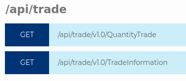
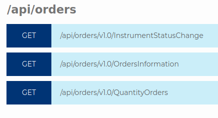
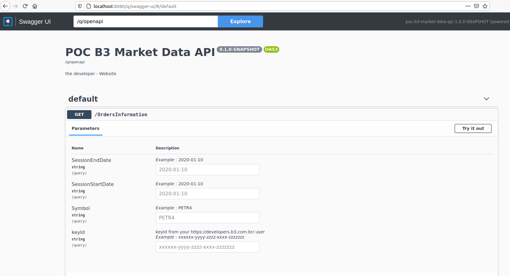
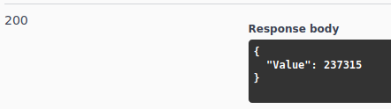

# POC of B3 Market Data API 

[B3](http://www.b3.com.br/en_us/) is a Brazilian stock exchange. Quoting their [website](http://www.b3.com.br/en_us/b3/about/who-we-are/):
> B3 S.A. – Brasil, Bolsa, Balcão is one of the world’s largest financial market infrastructure companies, providing trading services in an exchange and OTC environment.(...) It also has a solid tradition of innovation in products and technology and is one of the largest companies in market value holding a prominent global position in the stock market industry.

They are creating APIs that will allow partners, as brokers and banks, to consume their information.

The documentation is available at [b3 developers website](https://developers.b3.com.br).

There are three groups of APIs: `Market Data`, `B3 Investor` and `UP to data`.

Until this moment - March 15, 2021 - these APIs aren't on production yet.

But, there's a [sandbox](https://developers.b3.com.br/sandbox) that allows us to make some tests with the `Market Data` APIs.

The Market Data APIs are divided in two groups





This project allows us to execute one particular endpoint - `/api/orders/v1.0/QuantityOrders`:
> This API returns the consolidated of orders to buy and / or sell for a given date range. The data are available for consultation as of 01/02/2020, and at Sandbox data available are exclusively from the month 01/2020.

There are two main folders in this project:
- `api-client` - the project that will consume the api;
- `mock-server` - the project that will mock one B3 endpoint.

# Obtaining the KeyId to access the B3 sandbox

It's necessary to pass a **KeyId** parameter on the HTTP header to consume the B3 Sandbox.

To obtain this parameter, you must logon on the [b3 developers website](https://developers.b3.com.br), create an account and get the **KeyId**.

You will pass this **KeyId** to consume the B3 sandbox in this project.

# Running the project

There are a few options to run this project. Its possible to:
- Run it from its image on Docker Hub;
- Build it locally and run as a container;
- Run it with Quarkus development mode;
- Build it locally and run using a local [mock server](./mock-server/README.md) to mock the B3 sandbox.

When the project is started, you can access it at `http://localhost:8080/q/swagger-ui/` 



In this screen, just inform your KeyId, the other parameters and execute!

The response will be like this




# Running the project from its Docker Hub image

Execute:
```
$ docker run --name poc-b3-market-data -p 8080:8080 felipewind/poc-b3-market-data-api:1.0
```

# Building it locally as a Docker image and run

Execute:
```
$ ./run-b3.sh
```

This procces will build the same image that is at Docker Hub.

# Running it locally with Quarkus development mode

The B3 sandbox is a **HTTPS** web server, so if you want to run this project in your local JVM, it will be necessary to import the [b3 sandbox certificate](./api-client/certificates/b3-api.crt) to your java cacerts following [this instructions](#Import-the-B3-ssl-certificate-to-your-Java-platform).

This **certificate import** will be necessary **only** if you decide to run the project inside your local JVM, the Docker Hub image and the Docker image builded with the previous script already have the certificate imported.

Enter into the api-client folder and execute:
```
$ mvnw quarkus:dev
```


# Building locally and running with the B3 mock

The mock-server will be able at `http://localhost:8090/q/swagger-ui/`.

Execute this command to create a local docker image of the api-client and the mock-server and start them:
```
$ ./run-mock.sh
```

Or enter first into the mock-server folder and execute:
```
$ mvnw quarkus:dev -Ddebug=5006
```

And then enter into the api-client folder and execute:
```
$ mvn quarkus:dev -DB3_ENDPOINT=http://localhost:8090/api/orders
```


# Import the B3 ssl certificate into your Java platform

## Create the root.crt file

```
$ openssl s_client -showcerts -connect api-marketdata-sandbox.b3.com.br:443
```

Copy the content between `-----BEGIN CERTIFICATE-----` and `-----END CERTIFICATE-----` and save it into a file called `b3-api.crt`.

Or just use [this crt file](./certificates/b3-api.crt) already created.

## Import the file to the trusted root certificate of the Java platform

Find the cacerts file. It could be like `/etc/ssl/certs/java/cacerts`.

Execute the keytool command to import it:
```
sudo keytool -importcert -keystore /etc/ssl/certs/java/cacerts -storepass changeit -file /your-path/b3-api.crt -alias "b3-api-root"
```

## Website with complete instructions to import a ssl certificate
https://jfrog.com/knowledge-base/how-to-resolve-unable-to-find-valid-certification-path-to-requested-target-error/    


# Example of a http GET to consume the B3 API

```
https://api-marketdata-sandbox.b3.com.br/api/orders/v1.0/QuantityOrders?SessionStartDate=2020-01-10&SessionEndDate=2020-01-10&Symbol=PETR4
```
